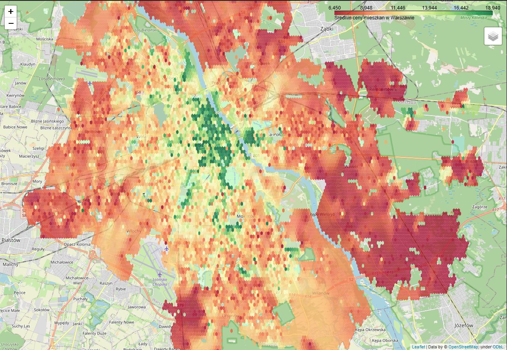

# RealITy

- Get data from otodom.pl "real estate / flat / sale"
- Get data from gratka.pl  ==||==
- Get data from morizon.pl ==||==
- Merge filtered data into one database, dmbs= PostgreSQL
- Added OpenStreetMap API call to get Citys' Districts (Polygons), Amenities, Tourism, Leisture (Nodes, Ways, Rels)
- Machine Learning alorithms predict price per square meter based on processed data (testing accuracy 72-80%, evaluations are based on a offer prices NOT transaction prices!)
- Possible to get nearest 
- Django framework + Docker + AWS / Azure

  Docker commands (deployment on local machine using docker swarm):
> docker stack deploy --compose-file docker-compose.yml realityweb  
> before deployment make sure if you have "nowa.sql" db file inside project otherwise change docker-compose.yml > postgres > volume (line 57)

